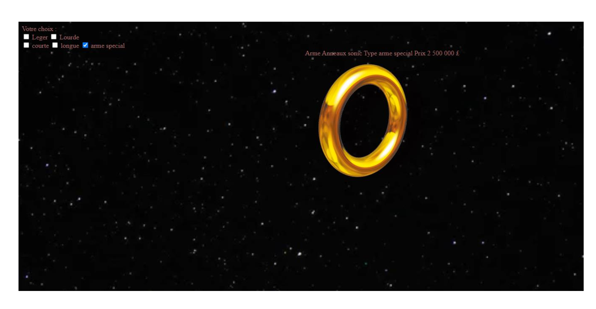
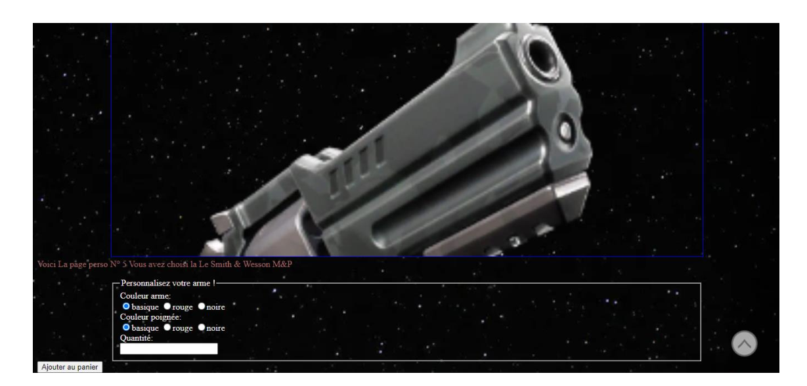

# Objectif

L'objectif n'est pas de faire un site esthétique mais fonctionel.

## Présentation

Le site se présente sous forme de grille où on peut choisir des items

On peut filtrer les objets, comme par exemple dans l'image ci-dessous en cochant la case arme spéciale :

En cliquant sur un objet, l'objet est mémorisé et on tombe sur le menu de personnalisation qu'on voit ci-dessous :

## Améliorations possibles
- Améliorer l'esthétique du site
- Pouvoir centrer l'image dans le menu de personnalisation
- Pouvoir modifier la couleur de l'objet
